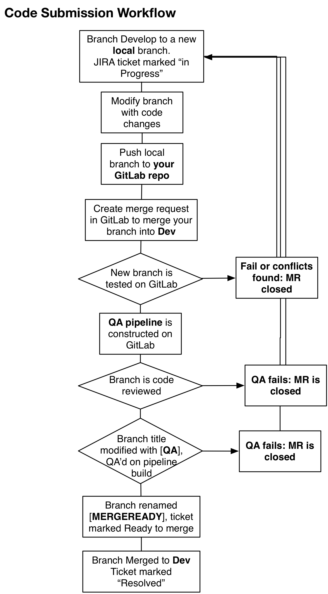

# GlobalNET Code Submission Process

Table of Contents
=================

* [Prerequisites](#prerequisites)
* [Initial Git Setup](#initial-git-setup)
* [GlobalNET Git Workflow](#globalnet-git-workflow)
* [Code submission: Feature branches](#code-submission-feature-branches)
  * [Code submission: flow chart](#code-submission-flow-chart)
  * [End of sprint: Create release version](#end-of-sprint-create-release-version)
  * [Hotfixes](#hotfixes)
  * [Quick Documentation Updates](#quick-documentation-updates)
* [Updating the Stage server](#updating-the-stage-server)
* [Updating the Production Server](#updating-the-production-server)
  * [How to rollback an update](#how-to-rollback-an-update)
* [Emergency Code Testing/Pushing Thursday night thru Monday night](#emergency-code-testingpushing-thursday-night-thru-monday-night)

## Prerequisites
- Working sandbox with Git installed and current code base
- Engineer Git account on git.civicactions.net

## Initial Git Setup
The following steps only need to be run once to setup your git environment.

1. **Clone the repository** (we generally call name this `~/workspace/gn2` for co-working consistency, but you can name it as you like):
```
cd ~/workspace
git clone git@git.civicactions.net:dsca/globalnet2.git gn2
```
2. **Fork the repository:**
- Go to https://git.civicactions.net/dsca/globalnet2 and click the 'Fork' button.
3. **Setup your own remotes** so that you can specify a remote by name. Do this on your current local copy of the globalnet repo:
```
cd ~/workspace/gn2
git remote rename origin prime
# Replace GITLAB_USERNAME to match your gitlab username in this next command
git remote add myfork git@git.civicactions.net:GITLAB_USERNAME/globalnet2.git
```
4. **Disable pushing to prime:**
```
git remote set-url --push prime no-pushing
```
5. ***Verify your remotes.*** `prime` and `myfork` should be listed as remotes.
```
git remote -v
```

## GlobalNET Git Workflow
Here is a summary of the approach:

The *prime/develop* branch is the main code base. This branch is used to update the Dev server each time the branch is updated. The Dev server is subject to periodic automated testing to ensure that changes pushed to Dev do not cause our standard tests to fail.

When we have a coding task, we create a new local branch of *prime/develop* and give it the name of the ticket we are working on. We then push that branch to our own repo (*myfork*) located on git.civications.net. From that branch (on git.civications.net), we submit a request to merge the branch with *develop* using the gitlab interface. The branch is built into two different instances, one for testing (the "test build", and one for QA (the "QA pipeline"). 

Once that branch passes all the automated tests, code review, and QA, it is merged by the tech lead into *develop*. The Dev server is then updated (using a command from the globalnet-int Slack channel), and the Devtest database is updated after that, (so that other developers can grab the most recent version of the devtest database after code has been merged and db configurations updated).

When we are ready to push *prime/develop* to Stage for integrated, manual testing (stage.globalnetplatform.org for testing), we create a new branch from *develop* and name it the next version iteration, (e.g. **v2.18.0**). Hotfixes (fixes introduced out of cycle, during a sprint) are indicated by being given a subversion number, (e.g. **v2.18.1**).

This enables us to test the exact same code on Stage that we will push to Prod. And it’s the exact code that passed tests on Dev prior to being branched for live testing on Stage. 

After Stage has been updated with a new version build, it is manually reviewed by the Product Owner to see how all  the new functions work with a recent dataset composed of live data. Finally, if Stage looks good, Prod (globalnetplatform.org, the live server) is updated with the same code that was used to update Stage. 


The next sections provide detail on:

- how code is checked out from *develop*,
- a new feature branch created in *myfork*,
- that feature branch is tested and then merged back into *develop*,
- how a “snapshot” is made of *develop* and installed on Stage for live testing,
* and then finally that “snapshot” is installed on the Production server.

  ​

## Code submission: Feature branches
**Feature branches** are what a developer interacts with on a day to day basis. Here is an example of what this might look like:

If a developer wants to do work on a ticket RD-1234 which requires a new chicken dance feature, the git process this developer will go through might look something like this:

1. **Open ticket.** At the beginning of a ticket, Engineer opens a JIRA ticket (e.g. RD-12340), assigns it to themself, and sets the status to "In Progress." 

   If the ticket needs clarified, it is incumbent upon each engineer to make sure they understand the problem in the ticket, and that the ticket description, success criteria, and QA steps all reflect what the product owner wants.

2. **Update develop branch.** The engineer updates their local *develop* branch with the latest code from *prime/develop*. 
```
git checkout develop
git pull --rebase prime develop
```
3. **Create new feature branch.** Engineer creates a new feature branch to work in using the ticket ID as the branch name.
```
git checkout -b RD-1234-chicken-dance
```
4. **Commit work.** At this point the developer will do his/her work and create multiple commits in their feature branch. 
5. Commits are made as small as possible, and multiple commits should tell the story of how the new function is built.
6. Each commit message contains the ticket ID and describes the work being done, (e.g. "RD-1234 Add a view to list users and groups")
7. **Rebase from prime/develop.** Once the work is done, push your to your fork repository located on GitLab. Before pushing your branch to your remote repo, it’s a good idea to rebase the feature branch before pushing, e.g.:
```
git pull --rebase prime develop
```
6. **Push to your remote repository.**
```
git push myfork rd-1234-chicken-dance
```
7. **Create Merge Request (MR).** After the branch has been pushed to *myfork* a merge request should be created against *prime/develop*. This is accomplished by submitting a GitLab merge request from your own repo, to merge your new branch into *prime/develop*  Your repo will be located at: http://gitlab.civicactions.net

   a) Make sure you provide a link to the JIRA ticket in the merge request description in GitLab.

8. Add a link to your MR as a comment in your original JIRA ticket; set the ticket status to **Code Review**, and remove your name from the JIRA ticket. Someone else will do code review and QA.

9. **Jenkins / Behat testing.** Your MR is built and tested against the current devtest database by the Jenkins server at https://ci.civicactions.net At the same time, a QA pipeline is built and deployed, ready for QA if the MR passes the test suite.

10. If branch fails test or rebase is needed, the MR will closed, and the JIRA ticket returned to back to you. JIRA Ticket status will be set back to To Do, and comments are added to the JIRA ticket to let the you know what happened. You can see the ticket fails by following the MR link you entered in the comments section, and click through the test fail links.

11. If the MR passes the test suite:

   a) JIRA ticket status is set to “QA” 

   b) Your MR will be tagged with a [QA] tag in front of the title,

   c) The QA pipeline link will be added as a new comment in the JIRA ticket, in the format:  http://[pipelineID]gn2.ci.civications.net

   and another staff member will QA the ticket.

12. **Manual QA.** Branch is QA’d on the QA pipeline build by another staff member. In some cases, you may need the ticket QA'd on another site, like Stage (to see how it works with "real" data, or on Learn if you need to send an email, or interact with a "fake" set of persistent data). In these cases, make a special note in the QA instructions of your ticket.

13. If QA of the QA pipeline build fails, the MR is closed, and the JIRA ticket returned to Engineer. Ticket status is changed back to ToDo and comments (and ideally screen shots) added to explain how the feature failed QA.

14. If QA of build passes. Comments are added detailing the specific steps that passed QA. The ticket is set to “Ready to Merge.”  The title of the MR is changed to reflect it is ready to merge by replacing [QA] with [MERGEREADY]

15. The Tech Lead will then merge each MR that has passed QA into Dev, and will rebuild the Dev and DevTest servers after each "chunk" of code merges.

16. Once a MR is merged into *develop*, the ticket is marked "Ready for PO Review" and assigned to the Product Owner for review on Stage, once Stage is updated to the next version.


### Code submission: flow chart




### End of sprint: Create release version
1. At end of Sprint, the *develop* branch is branched into a version branch, and the sub-version is incremented by one. For example, **v2.16.0** is incremented to **v2.17.0**
2. Stage is then updated by the Tech Lead by loading a recent backup of the Prod server, and then updating the code to the new version.
3. Stage is then declared "ready for review" by the Product Owner and Project Manager.


#### Hotfixes
1. If a hotfix is required, the version sub-version decimal version is incremented by one, For example, v.2.16.0 is incremented to v.2.16.1
2. Hotfixes go through the same updating process as scheduled code pushes, the only difference is that the Stage database is **NOT** updated (skipping steps 1.1 and 1.2 below


#### Quick Documentation Updates
We want this documentation to be as useful and accurate as possible. To skip the CI build process, include either `[ci skip]` or `[skip ci]` at the end of the last commit message of the branch you are pushing.

*Pro tip:* This is also useful if you are working on a large ticket and want to push your changes but your branch is not yet ready for a merge request. Remember you can always edit a commit message with `git commit --amend` if you need to remove the ci skip of your last commit when you are ready to request a merge.


## Updating the Stage server
1. The Staging server is then updated on the **Thursday of the end of the Sprint at 5 pm Eastern time**, with a current version of the Production database, and the code is updated to the new version branch. These instructions assume the user is logged into the stage server, and is located in the **~/stage/** directory.
2. The current db is dumped:
```
drush sql-dump
```
  2. The daily backup at `~/latest` is unpacked and uploaded to Stage:
```
drush sql-cli < ~/latest/[dbname]
```
  3. The code base is updated:
```
site-update gn2.stage [version name] nobackup
```
  4. The feature list is reviewed and any features (other than gn2_search) that aren’t reverted, need to be reverted.
    * To display the feature list:
```
drush fl
```
    * To revert a feature:
```
drush fr [feature name] ([feature name]) –y
```
  5. The rules list should be reviewed in the UI to ensure that all rules have been reverted. If not, you can manually revert all rules using drush:
```
drush rules-revert-all
```
  6. Any manual configuration that needs to happen must be noted in a separate Implementation ticket, assigned to the person doing the Stage update, with a deadline of 5pm Eastern on the day of the update.
     The implementation ticket is then revised with a new deadline so that manual configuration can be done with the push to the Production server on the following Monday.
  7. The release_history.txt file should be updated with a list of commits for the current branch. An easy way to do this is to install Drush Git Release Notes (https://www.drupal.org/project/grn) and generate a report for the current branch in CHANGELOG.txt format. (e.g. `drush rn 1d2aa3fd284331d84d37516f84dcd74f93166732 031d667e3dce1de55fcb719d1404c850b396edad --changelog`)
  8. The Staging site is reviewed to ensure that basic functions are restored.
  9. The Staging server is then reviewed by TL and Product Owner. Product Owner should review sprint product on Staging server and alert staff/open bug tickets if any problems are found.

TODO: We might want to create a release notes function that lists tickets associated with each release to act as a review checklist for TL and/or Product Owner.

## Updating the Production Server
On the Monday, at 5pm Eastern time after updating Stage, and after the Product Owner has approved the new version on Stage, the Production server is updated with the new version of the code.

1. Start the process with accepting the Code update ticket that contains the tag/branch name and any necessary manual update steps to be carried out after the automatic code upgrade.
2. Log into the production server as the globalnet user and work in the `prod/docroot` directory. If you use your local `drush` to do this, it's just one step:
```
drush @gn2.prod ssh
```
3. Check that `git status` is clean. (If not, stop process and investigate.)
```
git status
```
4. Put the site into maintenance mode, clear cache and fetch new code changes. Run:
```
drush vset maintenance_mode 1
drush cc all
git fetch
```
*(Note: these steps could be included in the `prod-update` script as per [RD-3535](https://globalnet.atlassian.net/browse/RD-3535).)*
5. **prod-update [versionID]** is run to update the Production server, e.g.:
```
prod-update v2.32.0
```
*Note: you may see this error which is OK (can we mitigate this somehow?):*
```
Error: Call to undefined function module_exists() in /var/www/prod/docroot/sites/all/modules/contrib/apc/drupal_apc_cache.inc, line 303
```
6. At this point the update process should notify Slack, and the Production server should be updated.
7. The feature list should be reviewed to make sure that all features have been reverted, and the rules list should be reviewed to ensure that all rules have been reverted. If not, run:
```
drush fr-all -y
drush cc all
drush rules-revert-all
```
8. Any manual configurations requested in Implementation tickets should be done after the code is updated, and all reversions verified.
9. The site should be taken out of “Maintenance Mode”
```
drush vset maintenance_mode 0
```
10. The TL and Product Owner should review the Production server to ensure that the site is functional.

### How to rollback an update
```
# show last update
$ git reflog -1
332a708 HEAD@{0}: checkout: moving from v2.31.1 to v2.30.3

# show number of commits between updates
$ git log --oneline v2.30.3..v2.31.2 | wc -l
106
```
*More work and explanations needed here...*

## Emergency Code Testing/Pushing Thursday night thru Monday night

There have been instances where a version is being tested on Stage, but there are urgent tickets that need QAing on Stage prior to the push to Prod on Monday. It is very important that:

1.  If code is pushed to Stage (i.e. merged into Dev, then a new version branch created),
2. AND the QA tests reveal a fail, then the new version branch should be removed, and the previous version branch pushed to Prod. 

If a QA test is a failure on Stage, it is imperative that whoever fails the tests, alerts both the original developer AND the Product Owner and Tech Lead that the current Stage code version needs to be reverted.
